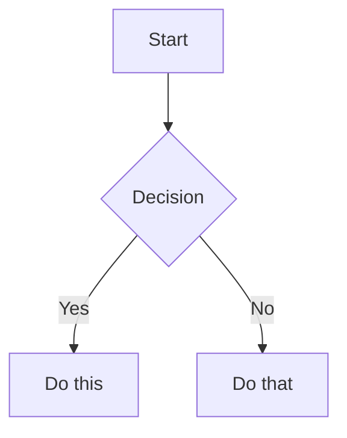

# eleventy-tech-blog

An Eleventy v3 starter for developer blogs. Designed for technical writing: Mermaid diagrams, syntax highlighting, light/dark theming, RSS feeds, and image optimization.

## Quick start

```
git clone <this-repo> my-project
cd my-project
npm install
npm run start
```

Then open `http://localhost:8088`.

## Customization

### Site metadata

Edit `content/_data/metadata.js`:

```js
export default {
  title: "Your Dev Blog",
  siteName: "yoursite.dev",
  url: "https://example.com/",
  language: "en",
  description: "A description of your blog.",
  author: {
    name: "Your Name",
    email: "you@example.com",
    url: "https://example.com/about/",
  },
}
```

### Writing posts

Add Markdown files to `content/posts/`. Each post needs front matter:

```yaml
---
title: The Title of This Post
date: 2025-01-15
tags:
  - git
  - javascript
description: Optional. Used in the HTML meta description and feed.
---
```

- `date` controls sort order
- `tags` generate automatic tag pages
- Add `draft: true` to exclude from production builds

### Mermaid diagrams

Diagrams are rendered via `@kevingimbel/eleventy-plugin-mermaid`. Use fenced code blocks:

````markdown

````

Diagrams respect the active light/dark theme.

### Syntax highlighting

PrismJS handles code blocks. Fenced code blocks with a language tag get highlighted:

````markdown
```javascript
const x = 1
```
````

### Themes

The site supports light, dark, and system-preference modes. Users switch via the header dropdown; preference is persisted in localStorage.

Colors and fonts are CSS custom properties at the top of `css/index.css`:

```css
:root {
  --font-body: Source Sans 3, 'Helvetica Neue', sans-serif;
  --font-mono: JetBrains Mono, monospace;
  --color-bg: #ffffff;
  --color-text: #1a1a1a;
}
```

**Fonts:** This template uses Google Fonts (Source Sans 3, JetBrains Mono). The `<link>` tags are in `_includes/layouts/base.njk`. To swap fonts, replace those tags and update the CSS variables.

## Project structure

```
content/
  _data/
    metadata.js          # Title, author, URL, feed config
  posts/
    my-first-post.md
    ...
  pages/                 # Static pages (About, etc.)
_includes/
  layouts/
    base.njk             # HTML shell with theme switcher
    post.njk             # Post layout
_config/
  filters.js             # Date formatting, tag filtering
css/
  index.css              # All styles, theme variables
js/
  theme-switcher.js      # Theme persistence
```

## npm scripts

| Command | Description |
|:--------|:------------|
| `npm run start` | Dev server at `0.0.0.0:8088` with live reload |
| `npm run build` | Production build to `_site/` |
| `npm run debug` | Build with Eleventy debug output |
| `npm run benchmark` | Performance benchmarking |

## Features

- **Mermaid diagrams** — rendered at build time, theme-aware
- **Syntax highlighting** — PrismJS with custom theme
- **Theme switching** — light, dark, system preference, persisted in localStorage
- **RSS/Atom feeds** — with custom XSL styling
- **Image optimization** — automatic AVIF/WebP generation with lazy loading
- **Tag pages** — automatic generation from post front matter
- **Drafts** — excluded from production builds via `draft: true`

## Deploy

Netlify and Vercel config files are included. For GitHub Pages, add a `.github/workflows/pages.yml` build workflow.
