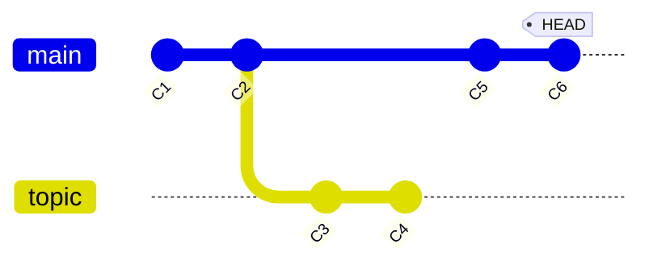
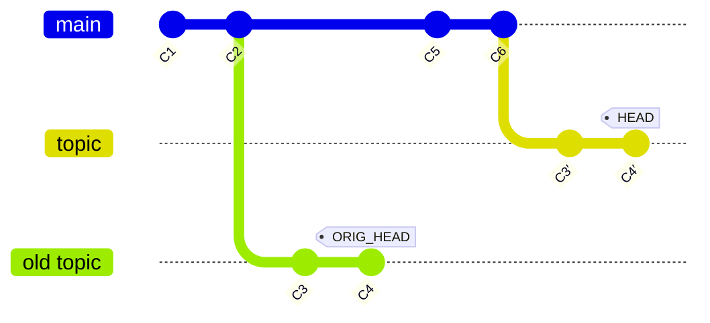

``` mermaid
    gitGraph LR:
       commit id: "C1"
       commit id: "C2"
       branch "topic"
       commit id: "C3"
       commit id: "C4"
       checkout main
       commit id: "C5"
       commit id: "C6" tag: "HEAD"
```


``` bash
# git rebase main topic
$ git checkout topic
$ git rebase main
```



```mermaid
    gitGraph LR:
       commit id: "C1"
       commit id: "C2"
       branch "old topic" order: 3
       commit id: "C3"
       commit id: "C4" tag: "ORIG_HEAD"
       checkout main
       commit id: "C5"
       commit id: "C6"
       branch "topic"
       commit id: "C3′"
       commit id: "C4′" tag: "HEAD"
```


<!-- excerpt -->
